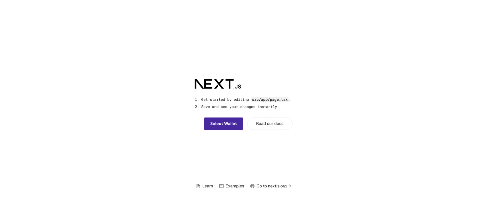

# vanilla-next-wallet-adapter

## :ledger: Index

- [About](#beginner-about)
  - [Installation](#electric_plug-installation)
  - [Commands](#package-commands)
- [File Structure](#file_folder-file-structure)



##  :beginner: About
Simple Next.js + Wallet-Adapter (@Solana)

###  :electric_plug: Installation
- 1 Clone this repo

```
$ git clone https://github.com/neocarvajal/vanilla-next-wallet-adapter.git
```
- 2 go to the downloaded project

```
$ cd vanilla-next-wallet-adapter/
```

- 3 Build and run project

- ```npm run build ```

- ```npm run dev ```

###  :package: Commands
- Commands to start the project.

- ```npm run dev ```
or
- ```npm run start ```

##  :file_folder: File Structure
- The structure of the project is as follows:

```
.├── src
│   └── app
│       ├── components
│       │   └── AppWalletProvider.tsx
│       ├── favicon.ico
│       ├── globals.css
│       ├── layout.tsx
│       └── page.tsx
```
